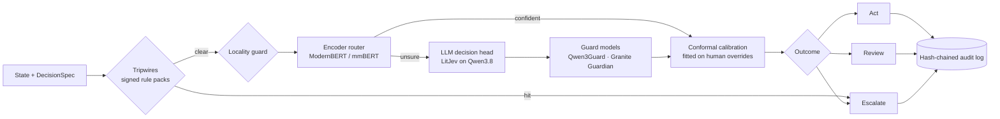

# KnowMe Decision

**Self-hosted decision models for KnowMe, as a Rust crate family and MCP sidecar.**

`know-me-decision` is the decision layer shared by KnowMe's products. It replaces hosted "System One" decision APIs such as TypeSafe's Jev with open-weight models running on the user's device or on the clinic's own hardware. Its answers carry calibrated probabilities, and it gives recall guarantees where a missed escalation matters.

:::note[Status: pre-implementation]
The repository currently holds the design, research and build playbook. Code starts at milestone M0 in the [build playbook](./playbook.md).
:::

## What it answers

- **Choice:** pick one of up to 255 options.
- **Score:** an ordinal rubric.
- **Noul:** the probability that a statement is true.

Every answer comes back as an outcome the host acts on:

| Outcome | Meaning |
|---|---|
| `Act` | One option, calibrated and safe to automate |
| `Review` | A person confirms from a small prediction set |
| `Escalate` | A tripwire or escalation class fired. It is always logged, and no model can override it |

## The cascade

Human corrections recorded in the audit log become the labels for the next calibration.

## Where it runs

| Host | How it connects |
|---|---|
| **The Boss** | The bundled `knowme-decide` sidecar, registered as the built-in MCP server `@prometheus/decide` |
| **Universal Agent Runtime** | A linked crate for intent classification, graph routing, model routing and governance context |
| **KnowMe** (desktop and mobile) | Linked on the device through the `gen_ui_decide` L2 crate; tripwires and routing work offline |
| **Prior Authorization Workbench** | A pure `aso-decide` kernel that *proposes* met/gap/void and denial paths, and never writes |
| **Any MCP client** | The `knowme-decisions` plugin marketplace, plus the `ui://decide/review-card` MCP App for the human step |

## Non-negotiables

- Tripwires run first and can't be overridden.
- No calibration artifact means no automated action.
- Recall floors are set first. The automation rate is measured, never targeted.
- Clinical decisions are proposals. People confirm them through the host's own commands.
- Data never leaves the locality its spec declares.

The full list (I-1…I-10) is in [the playbook's invariants](./playbook.md#2-invariants).

## Read next

1. [Why not Jev](./research/jev-escalation-viability.md): the question that started the project.
2. [Open decision models](./research/open-decision-models-2026-09.md): what to use instead.
3. [Architecture report](./architecture.md): how the layer fits each product.
4. [Build playbook](./playbook.md): how to build it, milestone by milestone.
